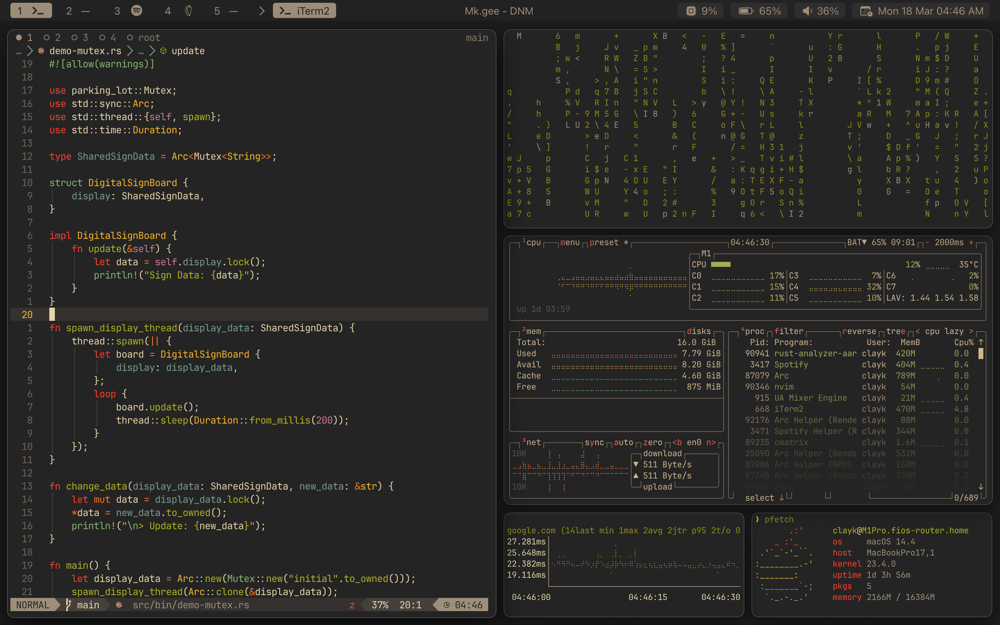

## My Dotfiles
- - -

Here's the list of my dotfiles that I manage with [stow](https://www.gnu.org/software/stow/).
Right now, it's only config files for my M1 MBP, but once 
I setup Linux, it will include those as well.

## Requirements

Ensure you have the following installed:

### Git

Git can be installed using your package manager of choice

For example:

```
$ pacman -S brew
```

or 

```
$ brew install git
```

### Stow

Stow can also be installed using your favorite package manager

For example:

```
$ pacman -S stow
```

or 

```
$ brew install stow
```

## Installation

Clone this repo in your $HOME directory using the following commands

```
$ git clone https://github.com/clay-k0/dotfiles.git 
$ cd dotfiles
```

Then, use GNU stow to create symlinks

```
$ stow .
```

## Usage

### Non-nested Dotfiles

If you copy a non-nested dotfile to this directory (i.e. from `~/{.name}` to `~/dotfiles/{.name}`), 
continue using `stow .` to create symlinks.


### Nested Dotfiles

However, if you copy a nested directory containing dotfile(s) in here (i.e. from `~/.config/{directory}` into `~/dotfiles/.config/{directory}`), use the `stow --adopt .` command instead.Note that this command will also take care of the above mentioned non-nested dotfiles.

## Screenshot

Still need to add SketchyBar config
